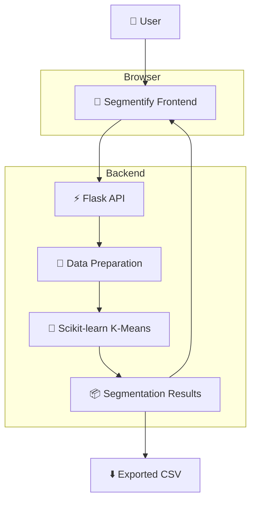
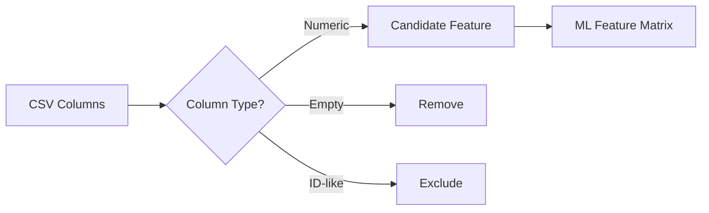
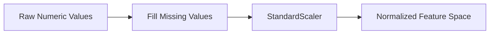
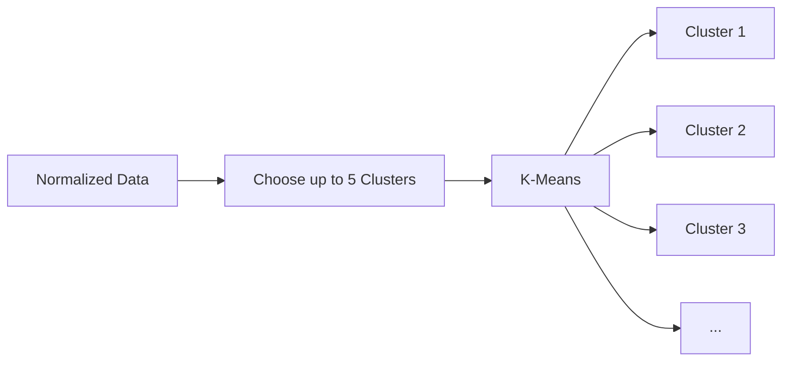
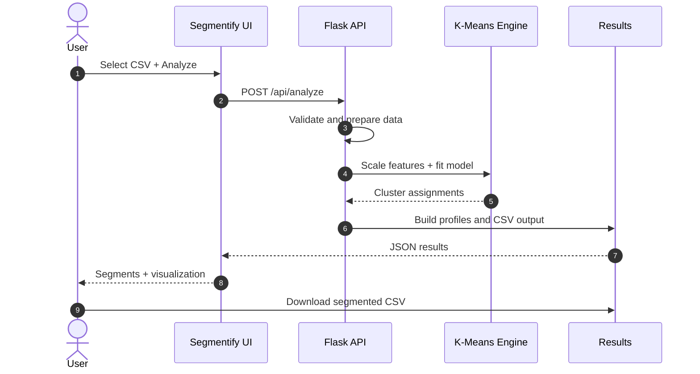
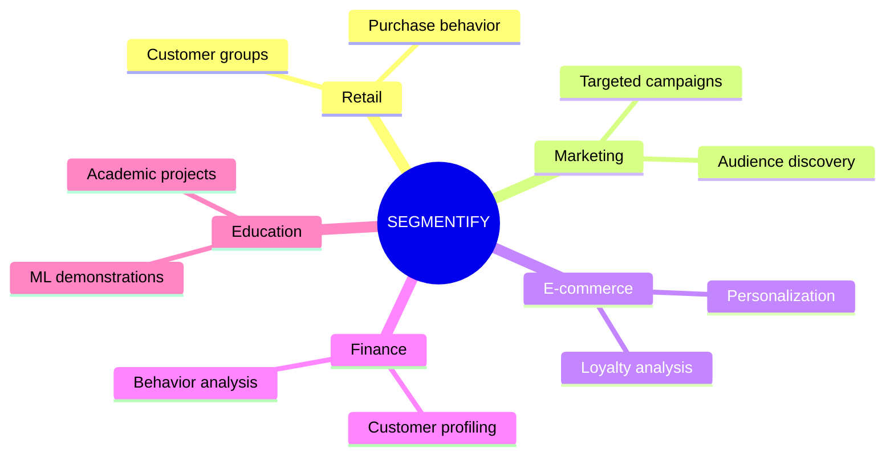
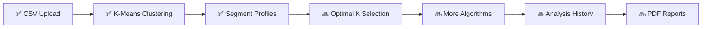

<div align="center">

# ✦ SEGMENTIFY
### AI-Powered Customer Intelligence Dashboard

<p>
  <b>Upload data. Discover hidden customer groups. Turn patterns into decisions.</b>
</p>

[](https://segmentify-customer-segmentation-hdq4wvijv-jack-5127.vercel.app)
[](https://www.python.org/)
[](https://flask.palletsprojects.com/)
[](https://scikit-learn.org/)
[](https://vercel.com/)

<br/>

[🚀 **Live Demo**](https://segmentify-customer-segmentation-hdq4wvijv-jack-5127.vercel.app) &nbsp;•&nbsp; [📦 **Repository**](https://github.com/Priyanshu710-ui/segmentify-customer-segmentation) &nbsp;•&nbsp; [🐛 **Report Bug**](https://github.com/Priyanshu710-ui/segmentify-customer-segmentation/issues)

<br/>

### 👨‍💻 Created by **Priyanshu**

</div>

---

## ⚡ What is Segmentify?

**Segmentify** is an interactive machine-learning dashboard that transforms raw customer data into meaningful customer groups using **K-Means clustering**.

Instead of manually digging through rows of CSV data, a user uploads a dataset and Segmentify automatically:

> **detects numerical features → prepares the data → scales it → clusters similar customers → builds segment profiles → visualizes the result → exports the segmented dataset**

---

# 🚀 Try It Live

<div align="center">

## [✨ OPEN SEGMENTIFY →](https://segmentify-customer-segmentation-hdq4wvijv-jack-5127.vercel.app)

**Bring your own CSV. Let the model find the patterns.**

[](https://segmentify-customer-segmentation-hdq4wvijv-jack-5127.vercel.app)

</div>

---

# 🧠 The Intelligence Pipeline


---

# 🏗️ System Architecture



---

# ✨ What You Can Do

<table>
<tr>
<td width="50%">

### 📤 Upload Your Data
Drop in a customer CSV and start analyzing immediately.

### 🔢 Automatic Feature Detection
Numerical columns are detected automatically while ID-like columns are excluded.

### 🧹 Smart Data Preparation
Missing numerical values are handled using median values before clustering.

### 📏 Fair Feature Scaling
`StandardScaler` normalizes feature ranges before K-Means runs.

</td>
<td width="50%">

### 🧠 AI Customer Segmentation
Similar customers are grouped into meaningful clusters.

### 🏷️ Readable Segment Labels
Income/spending datasets can receive labels such as **High Income, High Spenders**.

### 📊 Visual Exploration
Explore the generated customer groups and relationships between selected numerical features.

### ⬇️ Export Results
Download the original dataset enriched with segment IDs and names.

</td>
</tr>
</table>

---

# 🔬 How the Model Thinks

## 01 — Understand the dataset



## 02 — Prepare the feature space



## 03 — Find natural customer groups



---

# 🎯 Example Customer Segments

When the dataset contains suitable **income** and **spending** features, Segmentify can create easy-to-understand profiles:

| Segment | Income | Spending | Interpretation |
|---|---|---|---|
| 💎 High Income, High Spenders | High | High | Premium / high-value customers |
| 🧊 High Income, Low Spenders | High | Low | Untapped high-potential customers |
| 🔥 Low Income, High Spenders | Low | High | Highly engaged value-conscious customers |
| 🌱 Low Income, Low Spenders | Low | Low | Lower engagement segment |

> If those feature names are not available, Segmentify uses neutral names such as `Customer Group 1`, `Customer Group 2`, and so on.

---

# 📊 What Happens After You Click Analyze?



---

# 🖥️ Dashboard Flow

```text
┌─────────────────────────────────────────────────────────────────┐
│                        ✦ SEGMENTIFY                             │
│         AI-POWERED CUSTOMER INTELLIGENCE DASHBOARD              │
└─────────────────────────────────────────────────────────────────┘
                              │
                              ▼
                  ┌────────────────────────┐
                  │   📤 UPLOAD CSV DATA    │
                  └────────────────────────┘
                              │
                              ▼
        ┌─────────────────────────────────────────────┐
        │  👥 Total Customers  │  🎯 Segments         │
        │  🧠 Model            │  ⚡ Analysis Status   │
        └─────────────────────────────────────────────┘
                              │
                              ▼
                  ┌────────────────────────┐
                  │  🧩 CUSTOMER PROFILES   │
                  └────────────────────────┘
                              │
                              ▼
                  ┌────────────────────────┐
                  │  📊 DATA VISUALIZATION  │
                  └────────────────────────┘
                              │
                              ▼
                  ┌────────────────────────┐
                  │  ⬇️ DOWNLOAD RESULTS    │
                  └────────────────────────┘
```

---

# 🛠️ Technology Stack

<div align="center">

| Layer | Technology | Purpose |
|---|---|---|
| 🎨 Frontend | HTML • CSS • JavaScript | Dashboard and user interaction |
| ⚡ Backend | Python • Flask | API and request handling |
| 📦 Data | Pandas • NumPy | Dataset processing |
| 🧠 Machine Learning | Scikit-learn | Clustering and preprocessing |
| 📏 Scaling | StandardScaler | Feature normalization |
| 🚀 Deployment | Vercel | Live hosting |

</div>

---

# 📂 Project Blueprint

```text
segmentify-customer-segmentation/
│
├── 🐍 app.py
│   └── Flask routes + clustering workflow
│
├── 🎨 frontend/
│   ├── index.html          # Application structure
│   ├── style.css           # Dark dashboard UI
│   └── script.js           # Upload + API interaction
│
├── 📦 requirements.txt     # Python dependencies
├── 📊 outputs/             # Generated segmentation output
├── 🗂️ data/                # Dataset resources
├── 🧠 src/                 # Additional ML modules
├── 📓 notebooks/           # Experiments and exploration
└── 📖 README.md            # You are here 👋
```

---

# 🔌 API Reference

## `POST /api/analyze`

Send a CSV using multipart form data:

```text
file → your_dataset.csv
```

### Response includes

```json
{
  "success": true,
  "total_customers": 200,
  "clusters": 5,
  "features_used": ["Age", "Income", "Spending Score"],
  "segments": [],
  "points": []
}
```

## `GET /api/download`

Downloads the generated file:

```text
customers_with_segments.csv
```

The output contains the original data plus:

```text
Segment
Segment Name
```

---

# 🧪 Quick Start

### 1. Clone

```bash
git clone https://github.com/Priyanshu710-ui/segmentify-customer-segmentation.git
cd segmentify-customer-segmentation
```

### 2. Install dependencies

```bash
pip install -r requirements.txt
```

### 3. Launch

```bash
python app.py
```

### 4. Open

```text
http://127.0.0.1:5000
```

---

# 🎯 Where Can Segmentify Be Used?



---

# 🗺️ Roadmap



- [x] Interactive CSV upload
- [x] Automated numerical feature detection
- [x] Missing value handling
- [x] Feature scaling
- [x] K-Means customer segmentation
- [x] Segment profiles
- [x] Downloadable segmented dataset
- [ ] Automatic optimal **K** selection
- [ ] DBSCAN / hierarchical clustering
- [ ] Persistent analysis history
- [ ] Advanced interactive visualizations
- [ ] PDF insight reports

---

# ⭐ The One-Line Pitch

<div align="center">

## **From raw customer data → to actionable customer groups.**

### [🚀 TRY THE LIVE DEMO](https://segmentify-customer-segmentation-hdq4wvijv-jack-5127.vercel.app)

<br/>

If you like the project, consider giving it a ⭐

---

### Made with ❤️ and machine learning by **Priyanshu**

</div>
